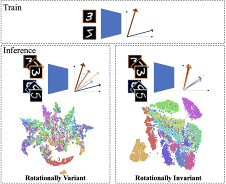

# SWN-GCN
Arxiv | Code

***Towards Deep Rotation Equivariant and Invariant Representation Learning using Graph Convolutional Network***

## Abstract

*Training a Convolutional Neural Network (CNN) to be robust against rotation has mostly been done with data augmentation. In this paper, another progressive vision of research direction is highlighted to encourage less dependence on data augmentation by achieving structural rotational invariance of a network. The deep equivariance-bridged SO(2) invariant network is proposed, which consists of two main parts, to echo such vision. First, Self-Weighted Nearest Neighbors Graph Convolutional Network (SWN-GCN) is proposed to implement Graph Convolutional Network (GCN) on the graph representation of an image to acquire rotationally equivariant representation, as GCN is more suitable for constructing deeper network than spectral graph convolution-based approaches. Then, invariant representation is eventually obtained with Global Average Pooling (GAP), a permutation-invariant operation suitable for aggregating high-dimensional representations, over the equivariant set of vertices retrieved from SWN-GCN. Our method achieves the state-of-the-art image classification performance on rotated MNIST and CIFAR-10 image, where the models are trained with a non-augmented dataset only. Then, quantitative and qualitative validations over invariance and equivariance of the representations are reported, respectively.*




## Conda Environment Set-Up

```
$ conda env create -f environment.yml
$ conda activate wn_gcn
```

## Test over Pre-trained Models

<!---
Download pre-trained model for [R-MNIST](https://kaistackr-my.sharepoint.com/:u:/g/personal/shwang_14_kaist_ac_kr/EeJa9ABKh3lHiwGB-cR97dwBYOz_k1exJOf1D-8ROFpwqQ?e=ujFg99) and [R-CIFAR-10](https://kaistackr-my.sharepoint.com/:u:/g/personal/shwang_14_kaist_ac_kr/EZZnIl_6z5ZPhBDp00rzEP0BVE99btFH9Xp9jHRJ4BZ-qg?e=hwNcgR) 
--->

* R-MNIST
```
python train.py --test_only True --test_dataset 'RotNIST' --test_model_name './pretrained_models/pretrained_wngcn_mnist.pth.tar'
```

* R-CIFAR-10
```
python train.py --test_only True --test_dataset 'RotCIFAR10' --test_model_name './pretrained_models/pretrained_wngcn_cifar10.pth.tar'
```

## Training a Model

* MNIST
```
python train.py --train_dataset 'MNIST' --test_dataset 'RotNIST' --m 0.05 --save_bestmodel_name './data/saved_models/wngcn_mnist.pth.tar'
```

* CIFAR-10
```
python train.py --train_dataset 'CIFAR10' --test_dataset 'RotCIFAR10' --m 0.05 --save_bestmodel_name './data/saved_models/wngcn_cifar10.pth.tar'
```
